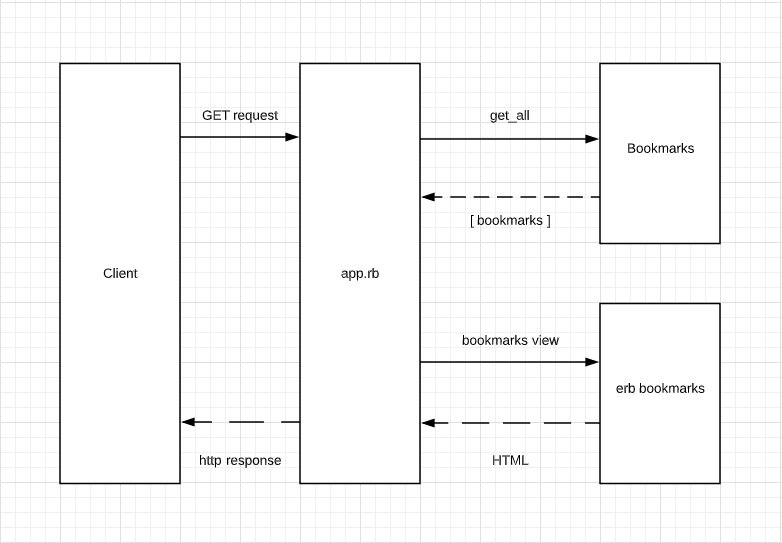

# Bookmarks manager

An application to store your favourite websites in a bookmarks manager. Created for week 4 of the Makers academy course.

## Setup and installation

This application requires the use of a PostgreSQL database. If PostgreSQL isn't installed on your machine you'll need to install it first:   
```
$ brew install postgresql
```

To setup the database follow these steps:
```bash
# connect to psql
$ psql
# create database using psql
$ CREATE DATABASE bookmark_manager;
# connect to database
$ \c bookmark_manager

# then run query found in 01_create_bookmark_table.sql file in db/migrations directory.
```

A test environment database will also need to be created in the same way as above, but labelled as ```bookmark_manager_test```.

## User stories
For this application the following user stories were considered.

```
As a user
So I can visit my favourite websites
I want to see a list of bookmarks
```

## Domain models

First domain model.


